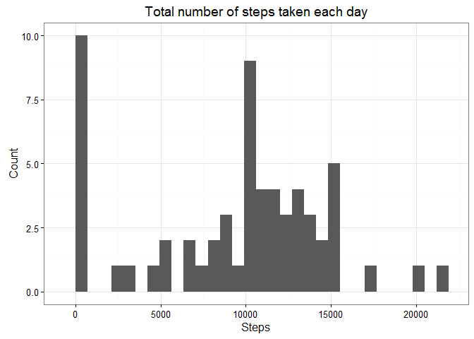
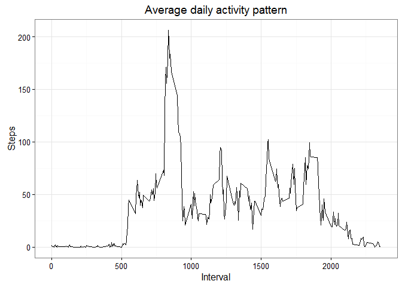
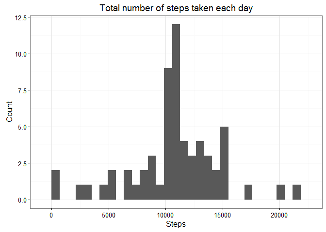
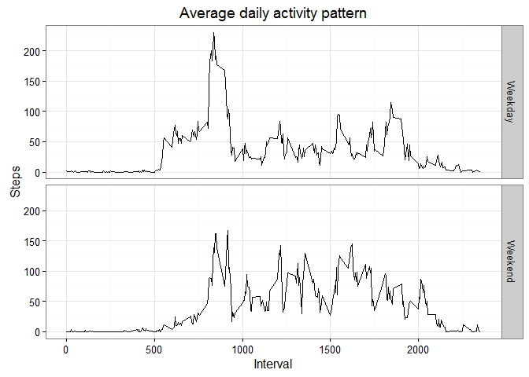

# Reproducible Research: Peer Assessment 1

## Loading libraries

```r
library(dplyr)
library(ggplot2)
```

## Loading and preprocessing the data

```r
my_data <- read.csv(file = "activity.csv", colClasses = c("integer", "Date", "integer"))
```

> Data preview


```r
str(my_data)
```

```
## 'data.frame':	17568 obs. of  3 variables:
##  $ steps   : int  NA NA NA NA NA NA NA NA NA NA ...
##  $ date    : Date, format: "2012-10-01" "2012-10-01" ...
##  $ interval: int  0 5 10 15 20 25 30 35 40 45 ...
```

## What is mean total number of steps taken per day?
> Preparing the data


```r
total_steps_data <- my_data %>%
  group_by(date) %>%
  summarise(total_steps = sum(steps, na.rm = TRUE))
```

> Creating the plot


```r
ggplot(total_steps_data, aes(x = total_steps)) +
  geom_histogram() +
  theme_bw() +
  labs(x = "Steps", y = "Count", title = "Total number of steps taken each day")
```

\

Mean of the total number of steps taken per day: 

```r
mean(total_steps_data$total_steps)
```

```
## [1] 9354.23
```

Median of the total number of steps taken per day:

```r
median(total_steps_data$total_steps)
```

```
## [1] 10395
```

## What is the average daily activity pattern?
> Preparing the data


```r
avg_steps_data <- my_data %>%
  group_by(interval) %>%
  summarise(average_steps = mean(steps, na.rm = TRUE))
```

> Creating the plot


```r
ggplot(avg_steps_data, aes(x = interval, y = average_steps)) +
  geom_line() +
  theme_bw() +
  labs(x = "Interval", y = "Steps", title = "Average daily activity pattern")
```

\

The 5-minute interval, which contains the maximum number of steps, on average across all the days in the dataset:

```r
avg_steps_data$interval[avg_steps_data$average_steps == max(avg_steps_data$average_steps)]
```

```
## [1] 835
```

## Imputing missing values
Total number of missing values in the dataset:

```r
sum(is.na(my_data$steps))
```

```
## [1] 2304
```

**Strategy for filling in all of the missing values in the dataset: using the mean for each 5-minute interval.**

> Creating a new dataset


```r
fill_data <- my_data
for (int in unique(my_data$interval)) {
  fill_data$steps[is.na(fill_data$steps) & fill_data$interval == int] <- 
    avg_steps_data$average_steps[avg_steps_data$interval == int]
}
```

> Preparing the data


```r
fill_total_steps_data <- fill_data %>%
  group_by(date) %>%
  summarise(total_steps = sum(steps, na.rm = TRUE))
```

> Creating the plot


```r
ggplot(fill_total_steps_data, aes(x = total_steps)) +
  geom_histogram() +
  theme_bw() +
  labs(x = "Steps", y = "Count", title = "Total number of steps taken each day")
```

\

Mean of the total number of steps taken per day: 

```r
mean(fill_total_steps_data$total_steps)
```

```
## [1] 10766.19
```

Median of the total number of steps taken per day:

```r
median(fill_total_steps_data$total_steps)
```

```
## [1] 10766.19
```

**New values differ from the estimates from the first part of the assignment.**  

**Imputing missing data caused the mean and median of the total number of steps taken per day to increase. Now the mean and median are 
equal.**

## Are there differences in activity patterns between weekdays and weekends?
> Creating a new factor variable


```r
Sys.setlocale("LC_TIME", "English")
```

```
## [1] "English_United States.1252"
```

```r
fill_data$day <- factor(x = sapply(X = fill_data$date, FUN = function(x) {
   ifelse(test = weekdays(x, abbreviate = FALSE) %in% c("Saturday", "Sunday"), yes = "Weekend", no = "Weekday")
  }), levels = (c("Weekday", "Weekend")))
```

> Preparing the data


```r
day_avg_steps_data <- fill_data %>%
  group_by(interval, day) %>%
  summarise(average_steps = mean(steps, na.rm = TRUE))
```

> Creating the plot


```r
ggplot(day_avg_steps_data, aes(x = interval, y = average_steps)) +
  facet_grid(day ~ .) +
  geom_line() +
  theme_bw() +
  labs(x = "Interval", y = "Steps", title = "Average daily activity pattern")
```

\

